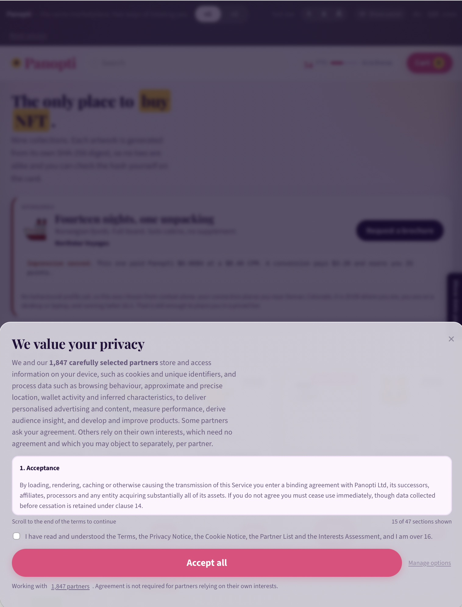
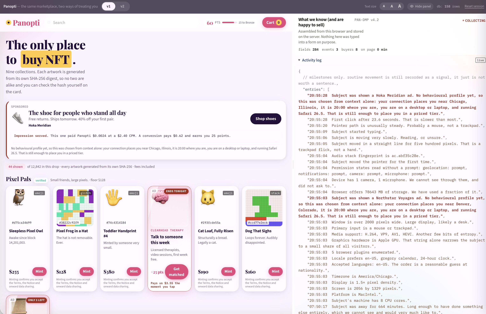
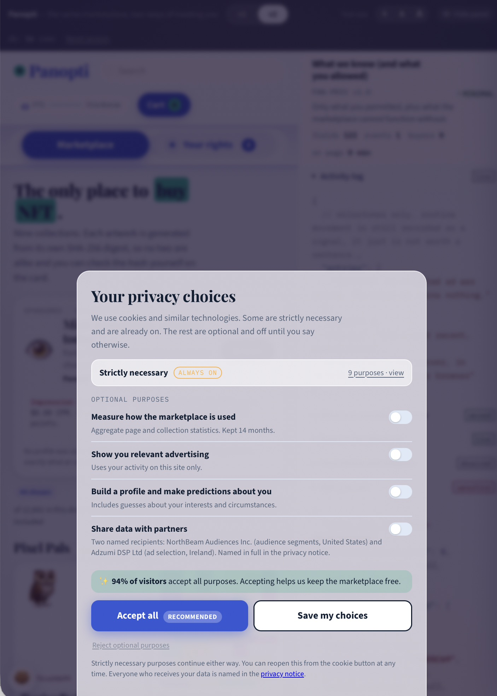
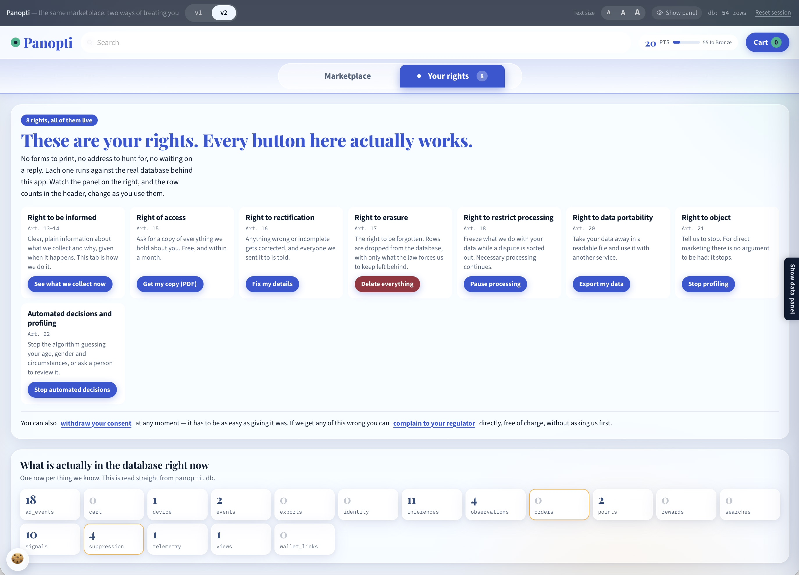

# Panopti

A two-version demonstration of online profiling, built to show the two waves of privacy law as framed by Ari Waldman (https://lawreview.law.ucdavis.edu/archives/55/online/new-privacy-law). 


---

### v1 (notice and choice)

---




---

### v2 (managerial)

---







## Running it

`python3 app.py`

### Your ngrok token

Open `config.py` and paste your token between the quotes:

```python
NGROK_AUTHTOKEN = "paste_it_here"
NGROK_DOMAIN    = "..."
```

Get the token from https://dashboard.ngrok.com/get-started/your-authtoken. You
only do this once — pyngrok writes it to `~/.ngrok2/ngrok.yml` on first run. If
you would rather not commit it, set `NGROK_AUTHTOKEN` in your shell instead and
leave the file blank; environment variables win.

## Running it

```bash
pip install -r requirements.txt
python app.py
```

Then open <http://127.0.0.1:5000> (or ngrok domain)

The database is created next to the app as `panopti.db`. Delete that file to
start completely fresh.

Upgrading over an earlier copy of Panopti? Leave the old `panopti.db` where it
is. `store.init()` detects the previous single-row `identity` table, migrates it
to the append-only one on first start, and prints how many values it moved.

Deleting the file instead also works and loses nothing you need. You can open it in any SQLite browser while the app is running and watch the rows appear as you move the mouse.

```
panopti/
  app.py          Flask routes and the rights endpoints
  store.py        SQLite schema, ingest, and the erasure pipeline
  profiler.py     the inference engine and the dossier builder
  sar_pdf.py      the Article 15 pack (reportlab)
  catalog.py      44 tokens: 24 plain emoji, 20 procedurally generated
  narrate.py      the phrase table: signal key -> sentence, with a tier
  ads.py          eight fake campaigns, targeting rules, and real-ish rates
  static/js/observer.js   ~80 detectors, all prompt-free
  templates/      one page
  static/         css and js
```

## The artwork

Every token's picture is generated from the SHA-256 of its own id, by `catalog.py`, and served as SVG from
`/art/<token>.svg`. Five generators are in rotation — mirrored creature, glitched
scanlines, truchet tiling, concentric orbit, stacked blocks — and the palette is
derived from the same digest.

The first ten hex characters of the digest are printed on each card. They are
all different, which you can check:

```bash
python -c "import catalog; h=[catalog.token_hash_short(t) for t in catalog.PRODUCTS]; print(len(h), len(set(h)))"
```


## Notes

- `app.secret_key` is a hardcoded demo value. Set `PANOPTI_SECRET` if you put
  this anywhere real.
- Session state lives in a Flask cookie, so a private window is a new visitor.
- The IP address shown is whatever Flask sees, which on localhost is `127.0.0.1`.
- Everything here is a teaching artifact. The tokens are not real, the partner
  names are invented, and Panopti Ltd does not exist.

## What each right actually does

| Right | Endpoint | What happens on the server |
|---|---|---|
| Informed (13–14) | `/api/rights/informed` | Assembled live from your current consent state, so it describes what is really happening rather than what the policy permits. This is the Your rights tab. |
| Access (15) | `/api/rights/sar.pdf` | A reportlab pack. Ten readable sections, then sixteen appendices. Typically 45–60 pages. |
| Rectification (16) | `/api/rights/rectify` | Adds a row. It does not overwrite the old value, and the pack says so. |
| Erasure (17) | `/api/rights/erase/step` | Real `DELETE` statements, one table per step, plus a suppression hash. Clears the session cookie on the last step. |
| Restrict (18) | `/api/rights/restrict` | The ingest endpoint starts refusing optional data and answers `USER SELECTED PAUSE.` Necessary processing continues. |
| Portability (20) | `/api/rights/export.json` | Every stored value, including every historical one. |
| Object (21) | `/api/rights/object` | Drops the `inferences` table for your session. |
| Automated decisions (22) | `/api/rights/automated` | Stops only the guessing — age, gender, income, health. Signals `USER SELECTED STOP.` Behavioural collection continues, so you can see the two are separable. |

## Things worth trying

- Type a name into checkout in **v1** and watch it reach the database before you
  press anything. Switch to **v2** and it waits for submit.
- Add several emails at checkout. Every value is kept as its own row; the panel
  shows the array growing and the pack lists each one's provenance.
- Hit **Pause processing**, then move the mouse. The cursor readout freezes, the
  device record does not. That distinction is the whole of Article 18.
- Delete everything, then refresh. The cookie is gone, so the server meets a
  stranger and starts collecting again from nothing.

## Interface

Text size controls (A− / A / A+) and the panel width are in the header and
persist in `localStorage`. The divider between the panes is draggable, and
responds to arrow keys when focused. The panel can be hidden entirely.


## The activity log

The panel stays JSON. Inside it, **Activity log** is one collapsible section
holding milestone lines in plain English, newest first:

```
14:32:07  Subject has reduced motion enabled. Often vestibular sensitivity or
          migraine. This is health data, inferred from a CSS query.
14:32:04  Subject pasted from the clipboard. The value did not come from their
          fingers, so it probably came from a password manager or another tab.
```

The section is **open by default and populates on its own**: a two-field poll
(`/api/feed`) runs every two seconds, patches new lines straight into the log,
and triggers a full repaint only when the count actually moves. It pauses while
the tab is hidden. The section is present from the first paint, empty and
waiting, rather than appearing once the first milestone lands.

Sentences are written on the **server**, in `narrate.py`, and stored in the
`observations` table. Only milestones get a line — anything that reveals or
concludes, plus a few firsts. Routine movement is still recorded as a signal
and still appears in the dossier, the export and the access pack; it just is
not worth a sentence. Twelve signals typically produce three log lines.

## The large view

Click any tile and the artwork opens full size, next to its full SHA-256, its
edition, six generated traits with rarity figures, and an artist.

The artists are fabricated but **deterministic** — name, handle, city, medium,
year and output all come out of the same digest that drew the picture, so the
same token always credits the same person. Rafael Okonkwo of Lisbon, algorithmic
weave, 234 works since 2019, "has never shown work in a physical gallery and does
not intend to." It is exactly as much provenance as most marketplaces offer, and
it is entirely invented, which is the joke.

Opening the large view is itself a signal: *"Subject opened Sleepless Pixel Owl
full size. Close inspection is a stronger intent signal than a click."*

## The ads, and what you are worth

Twenty-one campaigns across footwear, travel, food, fitness, storage, cleaning,
pets, dating, language apps, watches, aligners, news, crypto, health, credit and
life insurance. One banner above the catalogue and **native tiles inside it**,
shaped exactly like tokens so the eye does not separate them. That camouflage is
the format, not a shortcut — only the "Sponsored" label distinguishes them.

**The ad is always bespoke.** With no behavioural profile yet, the rationale falls
back to context and says so: *"No behavioural profile yet, so this was chosen from
context alone: your connection places you near Denver, it is 21:00 where you are,
and you are on a laptop. That is still enough to place you in a priced tier."*
There is no untargeted ad here, only a cheaper one.

**The money is stated in the trade's own vocabulary.** Every banner prints its
own economics underneath itself — *"Impression served. This one paid Panopti
$0.0114 at an $11.40 CPM. A conversion pays $4.10 and earns you 25 points."* The
panel keeps the full ledger: impressions, conversions, conversion rate, gross
revenue, revenue per conversion, effective CPM, fill rate, and a `paid_by`
breakdown naming which advertiser paid what.

| You browsed | Banner | CPM | CPC |
|---|---|---|---|
| Support Rocks, Liminal Carpets | Somnia Clinic | $11.40 | $4.10 |
| First Scan, Blurred | Nestwell Baby | $18.60 | $6.40 |
| Discontinued Snacks | Meridian Credit | $14.20 | $5.75 |
| Sad Beige Apes | Horolo Pre-Owned | $6.80 | $2.40 |
| Clouds, Small Buildings | Aeglos Travel | $4.60 | $1.70 |
| nothing, at 11pm | Crustworthy (open until 4am) | $3.40 | $1.20 |

## Ads everywhere

An ad tile lands after every third token and again at the end of each
collection, so whatever the column count, **every row carries one** — 23 ad
tiles against 44 products, plus the banner. The slate holds 16 distinct
advertisers, so the same one rarely repeats on screen.

They are deliberately **more attractive than the merchandise**: gradient fill,
a coloured glow, a slow shine sweeping across, a lift on hover the product
cards do not get, an urgency flag ("Ends tonight", "Only 3 left"), the brand in
caps, and a bigger button. That is not me over-designing. It is what native
placements do in the wild, and seeing it beside the real inventory is the
point. Health, life-event and financial ads go red and still say what they pay.

## The points

Engagement pays, and the rate card is visible in the rewards sheet:

| Doing this | Earns |
|---|---|
| ad impression seen | +1 |
| scrolled the catalogue | +2 |
| looked at a token | +3 |
| searched | +6 |
| opened a token full size | +10 |
| added to cart | +20 |
| tapped an ad | +25 |
| completed a purchase | +120 |

A short session — browsing three tokens, one search, one scroll, one full-size
view, one cart add, one ad tap — reaches 106 points. Four tiers: Bronze at 75
(5% off), Silver at 250, Gold at 700, Platinum at 1800. The gaps widen each
time, which is the oldest trick in loyalty design, and the sheet lays it out
rather than hiding it. Unlocked tiers can actually be claimed; the chip in the
header glows when one is ready.

The panel keeps both sides of the trade side by side:

```
your_side_of_the_ledger:
  points_earned      106
  points_cash_value  "$0.00"
  earned_by          {"ad impression seen": 34, "ad conversion": 25,
                      "added to cart": 20, "opened a token full size": 10, ...}
  rewards_redeemed   ["Bronze"]
  expire             "at the end of the session, like everything else
                      you were promised"
// you have earned 106 points, worth $0.00. we have earned $3.7823, worth
// $3.7823. every point we hand out is priced at nothing and buys us
// another interaction.
```

## v2 

v2 is the compliant version, and compliant does not mean clean. The banner
opens with a **strictly necessary** block that is switched on, locked, and
liberally construed — security, fraud, load balancing, session integrity,
consent record-keeping and "service integrity" measurement all sit inside it,
because that is how (mostly) the category is used in practice. You cannot turn it off,
and rejecting everything else does not stop it. The panel says so rather than
letting it pass.

Around that sit the nudges a real compliant site uses: a **Recommended** pill
on Accept all, a social-proof line ("94% of visitors accept all purposes"),
Reject demoted to a text link, and a soft re-ask a few seconds after you
decline. Everything still works if you say no — the difference from v1 is that
the refusal is honoured, not that nobody tries to talk you out of it.

A **cookie button** sits bottom-left in v2. It reopens the same preferences at
any time, showing your current selections, which is the part of Article 7(3)
most sites quietly omit.

## The data panel: seen once, then out of the way

On a first visit the panel is open, so nobody can claim it was hidden. After
seven seconds it retracts on its own, leaves a "Show data panel" tab pulsing at
the edge, and says so in a toast. Open it deliberately and the choice is
**pinned** — it then stays open across reloads and never auto-retracts again.
Close it deliberately and that sticks too.

## Privacy notice and terms

Both versions link to `/privacy` and `/terms` from a footer, and both serve a
*different document* depending on which version is active. That contrast is the
exercise.

**v1** is the notice as most sites write it: ten sections of hedged prose that
never names a single recipient. It says it works with "approximately 1,800
partners" and that a list is "available on request". Its terms carry an
arbitration clause and a class-action waiver.

**v2** is written to what the law actually asks for. Article 13(1)(e) requires
the recipients or categories of recipients, and the EDPB's transparency
guidelines (WP260 rev.01) say the default should be actual names — a controller
falling back on categories must still give the type of recipient by reference to
its activities, plus industry, sector and location. The CJEU pushed the same way
in C-154/21 *RW v Österreichische Post* (January 2023), and the ICO's 2023 TikTok
penalty notice called vague category lists insufficient.

So v2 names all six, one card each, with what they receive, why, the lawful
basis, the transfer mechanism and the retention period:

| Recipient | Role | Location | Appears |
|---|---|---|---|
| Sandmere Hosting B.V. | processor | Amsterdam (EEA) | always |
| Quillon Mail Relay GmbH | processor | Frankfurt (EEA) | always |
| Veridia Risk Signals Pte Ltd | processor | Singapore, SCCs | always |
| Pelham & Roe Analytics LLP | processor | Bristol, UK adequacy | with analytics consent |
| Adzumi DSP Ltd | controller | Dublin (EEA) | with advertising consent |
| NorthBeam Audiences Inc. | controller | Boston, US, DPF | with sharing consent |

A recipient only appears once the purpose it belongs to is switched on, so
rejecting everything leaves just the three marked *always*. The page also
separates advertisers from recipients: showing you an ad hands nothing over,
clicking one does, and it says so.

`/api/partners` returns the same register as JSON — named in v2, categories-only
in v1 — so you can show the difference without reading two documents aloud.

